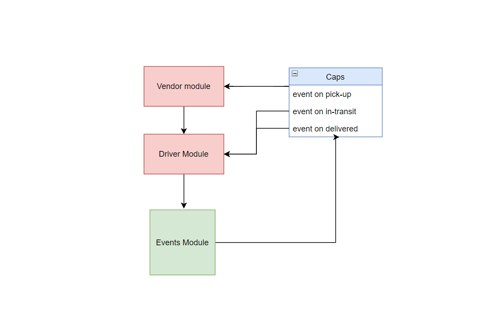

# CAPS (Code Academy Parcel Service)

CAPS will simulate a delivery service where vendors (such a flower shops) will ship products using our delivery service and when our drivers deliver them, be notified that their customers received what they purchased.

## UML 

## Links

https://github.com/Mohammed-Alramahi/caps/pull/1
